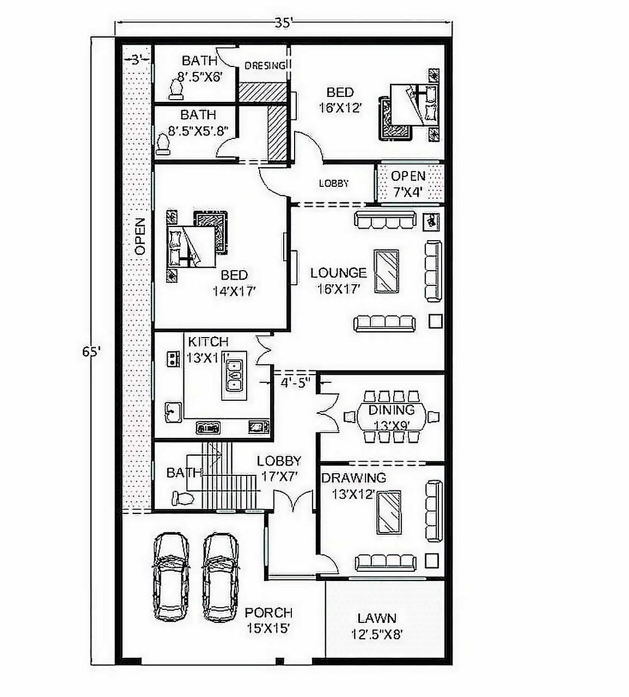
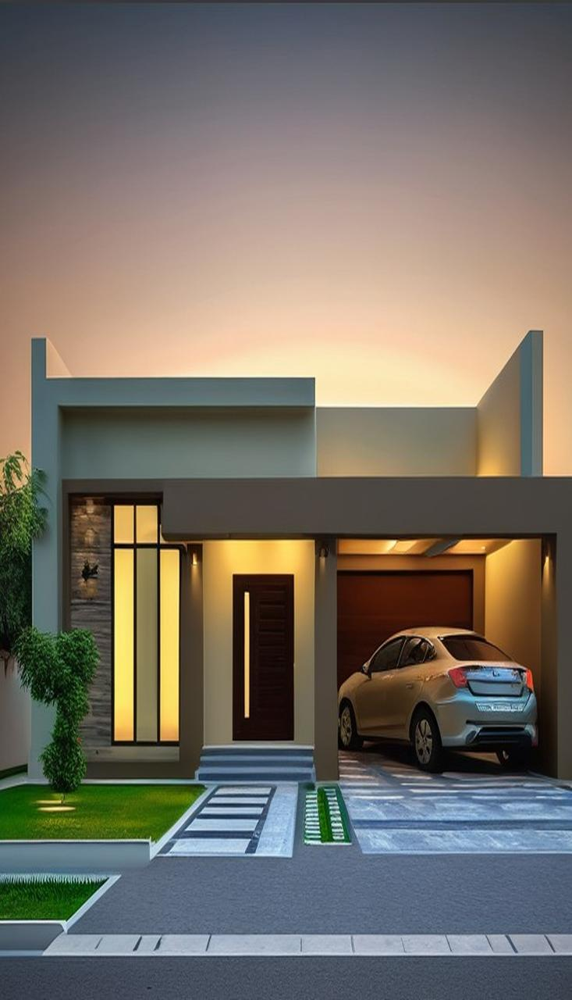

# Floorplan-to-Exterior Generator using Diffusion Models

A simple one-click Google Colab notebook that transforms 2D floorplan images into realistic house exterior designs using AI. Specialized for **Pakistani architecture** styles.

[](https://colab.research.google.com/github/yourusername/floorplan-to-exterior-generator/blob/main/Floorplan_to_Exterior_Generator.ipynb)

## How It Works

**Simple One-Cell Process:**
1. Upload your floorplan image
2. Run the single cell
3. Get your exterior design instantly

The AI automatically detects:
- Number of bedrooms
- Number of bathrooms  
- Number of floors
- Generates appropriate single-story or multi-story exterior

## Usage

Just run this one cell in the Colab notebook:

```python
# Upload and generate in one go
from floorplan_generator import generate_house_exterior

# This handles everything: upload, analysis, and generation
result = generate_house_exterior()

# Shows your floorplan → detecting the num of floors and others → exterior design
display_results(result)
```

## Sample Results

### Single Floor Designs

| Input Floorplan | Generated Exterior | Auto-Detected |
|----------------|-------------------|---------------|
|  |  | 1 Floor |
|  |  | 1 Floor |

### Two Floor Designs

| Input Floorplan | Generated Exterior | Auto-Detected |
|----------------|-------------------|---------------|
|  |  | 2 Floors |
|  |  | 2 Floors |

### Style Variations

The system automatically generates different styles based on the detected layout:

**Single Floor → Ranch/Bungalow Style**
- Horizontal emphasis
- Wide frontage
- Single-level Pakistani design elements

**Two Floor → Multi-Story Design**  
- Vertical elements
- Balconies and upper-level features
- Traditional Pakistani multi-story architecture

## Key Features

- **One-Click Operation** - Everything happens in a single cell
- **Automatic Detection** - No manual input needed for room counts or floors
- **Instant Results** - Generate and view results immediately
- **Pakistani Architecture** - Culturally accurate traditional and modern designs
- **Smart Adaptation** - Different styles for single vs multi-story layouts
- **No Setup Required** - All dependencies load automatically

## What You Need

- Google account
- A floorplan image (JPG, PNG)
- One click to run

## Generated Output Includes

- Original floorplan image
- Detected metadata (bedrooms, bathrooms, floors)
- Generated exterior design
- Style information
- Download option for the result

## Technical Notes

- **Runtime**: ~30-60 seconds total
- **GPU**: Automatically uses Colab's free GPU
- **Image Size**: Supports common floorplan image sizes
- **Styles**: Traditional Pakistani, Modern Pakistani, Contemporary

## Troubleshooting

**If something goes wrong:**
- Restart runtime and run the cell again  
- Make sure your floorplan image is clear and readable
- Switch to GPU runtime if generation is slow

## Example Output Format

```
📋 Analysis Results:
✓ Bedrooms: 3
✓ Bathrooms: 2
✓ Floors: 1
🏠 Style: Single-story Pakistani Traditional

🎨 Generated Exterior Design:
[Your generated house exterior image appears here]

💾 Download your result ⬇️
```

## License

MIT License - Use freely for personal and commercial projects.

## Citation

```bibtex
@misc{floorplan_exterior_colab_2024,
  title={One-Click Floorplan-to-Exterior Generator},
  author={Your Name},
  year={2024},
  howpublished={Google Colab Notebook}
}
```
